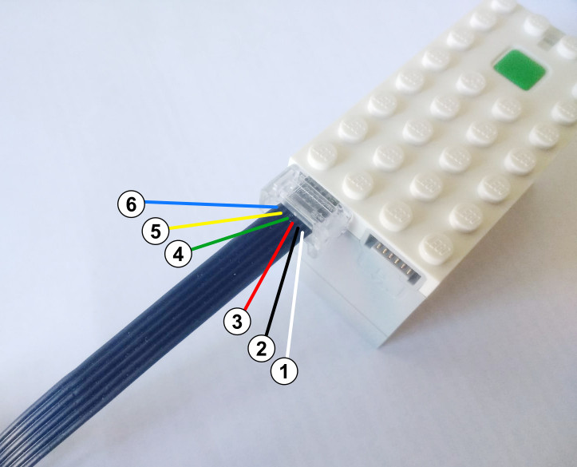

.. pybricks-requirements:: pybricks-iodevices

Generic UART Device
^^^^^^^^^^^^^^^^^^^

Powered Up and EV3 support connecting generic UART devices to the hub. The pinout
is shown below. Note the orientation of the connector. For EV3, the internal
wire colors match those on the diagram below.

.. list-table::
   :header-rows: 1

   * - Pin
     - Powered Up (UART)
     - EV3 (UART sensor)
     - EV3 (I2C sensor)
   * - 1 (white)
     - Motor Terminal 1
     - Optional battery power
     - Optional battery power
   * - 2 (black)
     - Motor Terminal 2
     - N/A
     - N/A
   * - 3 (red)
     - Ground
     - Ground
     - Ground
   * - 4 (green)
     - VCC (3.3 V)
     - VCC (5 V)
     - VCC (5 V)
   * - 5 (yellow)
     - Hub TX (Sensor RX) (3.3 V)
     - Hub TX (Sensor RX) (3.3 V)
     - SCL (master) (3.3 V)
   * - 6 (blue)
     - Hub RX (Sensor TX) (3.3 V)
     - Hub RX (Sensor TX) (3.3 V)
     - SDA (master) (3.3 V)

.. autoclass:: pybricks.iodevices.UARTDevice

**Example: Read and write to a UART device**

.. literalinclude::
   ../../../examples/ev3/uart_basics/main.py
